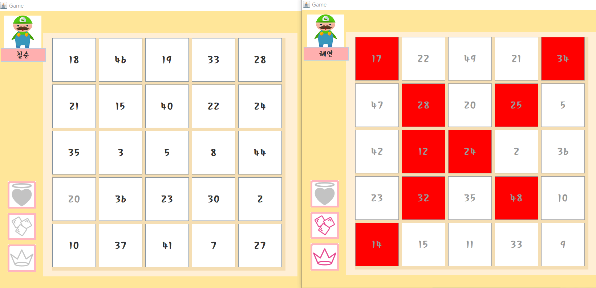
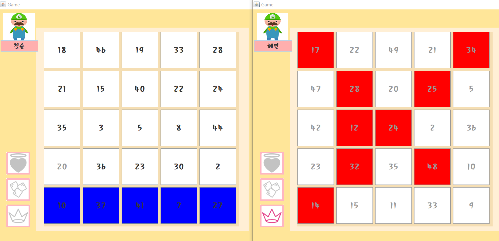
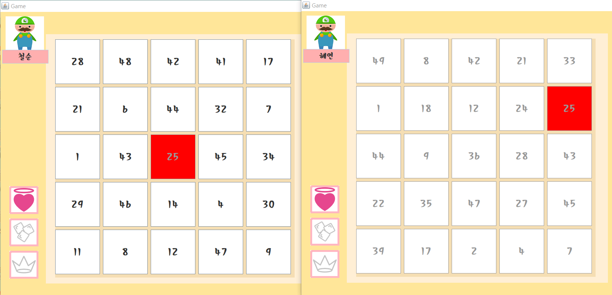

# Problem Bingo


## Game Rule

1. 1 vs 1 competition.
2. The beginning of the game is decided by **Rock scissor Paper**.
3. The person who wins the "rock paper scissors" game **selects the number of problems.** Since then, the person who get the right answer **continue to choose a problem wanted.**
4. Bingo sheet's numbers are **randomized** and Each user is given a different version of the bingo sheet.
5. The user who answers the problem can erase the corresponding number, **but** the counterpart can not erase the number.
6. The number of problem with opponent that got the right answer can be erased using **item** or correcting **the number's other problem.**
7. There are **three item functions** Freeze the opponent's bottom line Erase the cell you want to erase Randomly revive the cell that the opponent cleared

------

#### 

### **1. Main goal**

**Make a functional game**

> *: component of game for **fun** + component of education for **learning***

> *-**Functional game ?****Functional games that incorporate various functions**such as education, medical treatment, and training**into the main entertainment elements of the game*

### **2. Key features**

```
1)Select category that you want to solve.
- Kind of Category : social, entertainment, English word, history, multiplication table

2) Solving problem by competition.
- 1 vs 1 matching.

3) Remove a bingo block by solving problem.
- information about this is in the content page.

4) Have many Item function and Mission.
```


### **3. Technology**

```
* G.U.I - JAVA swing

* Chat service - Socket programming for multithread

* Database - Use JDBC

* BGM - JAVAX sound
```


### 4. Contents and Game Rule

> ##### MAIN SCREEN


```
* Click the Login button and enter your name.
* You are ready to start the game.
* Click the Start button.
```


```
* After the start button, you can select the mode.
* Then, select the category.
```

------

> **When game is started**


```
* First, do rock-paper-scissors to decide order.
* Choose a number you want
```

> **When choose a number**


```
* Solve a problem according to category you chose
```

> **When after you solve a problem**


```
* If you get the right answer you can delete the number
* also you receive one more chance to pick a number
```


```
* If you wrong answer, your turn goes to opponent then 
  opponent have a chance to solve that problem.
```

> **Special Function**


```
There are three item functions
* Freeze the opponent's bottom line
* Erase the cell randomly in your bingo
* Randomly revive the cell that the opponent cleared 
```



```
* Item 1) Freeze the opponent's bottom line
```



```
* Item 2) Erase the cell randomly in your bingo
```

## 

```
* Item 3) Randomly revive the cell that the opponent cleared
```


```
There is a mission function
* To win game, you have to erase the cell to match the mission
```

------

## Member Info

MEMBER INFORMATION

- member 1
  `name` : Lee Ye Ji
  `student number` : 201635838
  `e-mail` : [yagee97@naver.com](mailto:yagee97@naver.com)
  `role` : design, construct DB, itemfunction_1
  construct all program
- member 2
  `name` : Lee Cheol Soon
  `student number` : 201635842
  `e-mail` : [chirsoon@naver.com](mailto:chirsoon@naver.com)
  `role` : first presentation, construct DB, itemfunction_2
  construct all program
- member 3
  `name` : Lim Hyo Jin
  `student number` : 201635844
  `e-mail` : [qndnd1@naver.com](mailto:qndnd1@naver.com)
  `role` : managing wiki page, construct DB, itemfunction_3
  construct all program
- member 4
  `name` : Choi Hye Yeon
  `student number` : 201635850
  `e-mail` : [chlgpdus921@naver.com](mailto:chlgpdus921@naver.com)
  `role` : final presentation, chatting program,
  construct all program